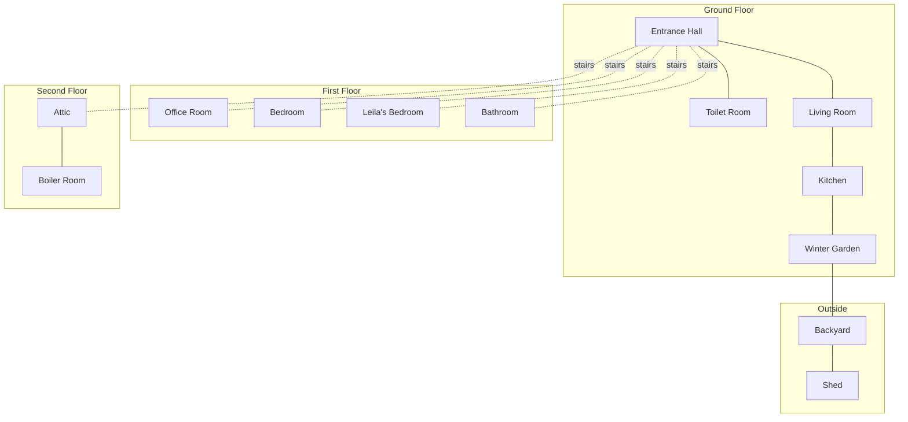

# House Layout

This is a Home Assistant-oriented view of the house, based on the floor plans and room mapping we agreed on.

## Mermaid Layout



## Ground Floor

```text
+-------------------------------------------+
|               Winter Garden               |
+----------------------+--------------------+
|       Kitchen        |    Living Room     |
|                      |                    |
|                      |                    |
+-----------+----------+--------------------+
| Toilet    |       Entrance Hall           |
| Room      |                               |
+-----------+-------------------------------+
```

Outside related areas:

```text
+---------------------------+
|         Backyard          |
|                           |
|   +-------------------+   |
|   |       Shed        |   |
|   +-------------------+   |
+---------------------------+
```

## First Floor

```text
+--------------------+----------------------+
|    Office Room     |       Bedroom        |
|                    |                      |
+----------+---------+----------------------+
| Bathroom |      Leila's Bedroom           |
|          |                                |
+----------+--------------------------------+
```

## Second Floor

```text
+-------------------------------------------+
|                   Attic                   |
|                                           |
|  +-------------------+                    |
|  |   Boiler Room     |                    |
|  |   small nook      |                    |
|  +-------------------+                    |
+-------------------------------------------+
```

## Final Home Assistant Areas

- entrance hall
- living room
- kitchen
- winter garden
- backyard
- shed
- toilet room
- office room
- bedroom
- Leila's bedroom
- bathroom
- attic
- boiler room

## Notes

- kitchen exists as its own area even though it has no smart devices yet
- winter garden is its own climate zone
- entrance hall and toilet room lights should be grouped in Home Assistant for room-level control
- the boiler room is a small equipment area within the second floor attic layout
- this is an automation-oriented map, not a precise architectural drawing
